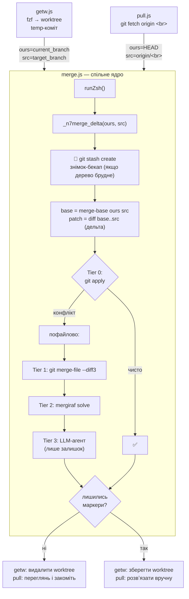

# @7n/n

CLI-утиліта `@7n/n` (Bun monorepo).

## Встановлення

```bash
bun add @7n/n
# або глобально
npm i -g @7n/n
```

## Використання

```bash
npx @7n/n greet "світ"   # Привіт, світ!
npx @7n/n --version
npx @7n/n --help
```

### `getw` — перенести зміни з worktree

```bash
npx @7n/n getw
```

Інтерактивно (через [`fzf`](https://github.com/junegunn/fzf)) обирає git-worktree з-під `.worktrees/`, переносить **лише його дельту** (від спільного merge-base) у **поточну** гілку як unstaged, після чого видаляє той worktree і його гілку. Файли, які змінювала тільки поточна гілка, не зачіпаються.

При конфлікті перенесення **не падає**, а резолвить багаторівнево (дешеве → дороге):

1. **Tier 0** — чистий `git apply` (без індексу).
2. **Tier 1** — пофайловий 3-way `git merge-file --diff3` (працює лише по файлах, без індексу, тож без помилок `does not match index`).
   - **`bun.lock`** (лише в **корені** репо) — **не** мержиться (ні merge-file, ні mergiraf, ні агент). Якщо кореневий lock **відрізняється** від версії у worktree-гілці — після успішного мержу скрипт запускає **`bun install`**. Якщо збігаються — `bun install` не викликається.
   - Інші lock-файли (`package-lock.json`, `pnpm-lock.yaml`, `yarn.lock`) беруться з worktree-гілки — перегенеруй відповідним менеджером.
3. **Tier 2** _(опційно)_ — структурний AST-авторезолвер [Mergiraf](https://mergiraf.org) (`mergiraf solve`). Якщо `mergiraf` відсутній у `PATH`, скрипт **сам ставить його через `brew install mergiraf`** (фолбек — `cargo install --locked mergiraf`). Вимикається `N7MERGE_NO_MERGIRAF=1`. Розв'язує конфлікти, які line-based diff3 позначає дарма — і зменшує навантаження на агента.
4. **Tier 3** — LLM-агент (`pi -p` → `claude -p` → `cursor-agent -p`) лише на залишок із маркерами.

Розподіл ролей: **скрипт** детерміновано робить 3-way, авторезолвить, виносить вердикт (чи лишились маркери), прибирає й перегенеровує `bun.lock`; **агент** робить лише творчу частину — прибирає маркери (нічого не видаляє, git не запускає) і друкує **per-file підсумок** (що хотіла кожна сторона і як примирено) у stdout. Порядок агентів — `pi -p` → `claude -p` → `cursor-agent -p`; модель Pi задається `N7MERGE_PI_MODEL`, Claude — `N7MERGE_MODEL` (default `sonnet`), Cursor — `N7MERGE_CURSOR_MODEL`. Worktree видаляється лише коли маркерів не лишилось; інакше — зберігається для ручного доведення.

**Pre-flight бекап.** Перед перенесенням ядро робить знімок твоїх незакомічених змін через `git stash create` (commit-знімок, який **не чіпає** робоче дерево й нічого не очищає) і кладе його у stash-список. У stdout друкується команда відкату — `git stash apply <sha>` (відновити) і `git stash drop` (прибрати), якщо все ок. Це безпечна точка повернення на випадок, якщо мердж або агент щось зіпсує (закомічене й staged pull і так не чіпає).

> **Env-кнопки** (спільні для `getw` і `pull`): `N7MERGE_PI_MODEL`, `N7MERGE_MODEL`, `N7MERGE_CURSOR_MODEL`, `N7MERGE_NO_MERGIRAF`. Для зворотної сумісності, якщо нову змінну не задано, читаються історичні `GETW_MERGE_MODEL` / `GETW_MERGE_CURSOR_MODEL` / `GETW_NO_MERGIRAF`.

Потребує `zsh` та `git`; якщо `fzf` відсутній — автоматично ставить його через `brew install fzf` (потрібен Homebrew).

### `pull` — накотити дельту origin/&lt;гілка&gt;

```bash
npx @7n/n pull            # origin/<поточна-гілка>
npx @7n/n pull feature-x  # origin/feature-x
```

Те саме delta-перенесення, що й `getw` (**спільне ядро** `_n7merge_delta` у `merge.js`), але джерело — **віддалена** гілка: спершу `git fetch origin <гілка>`, далі накочує у **поточне** робоче дерево як unstaged **лише дельту** `merge-base(HEAD, origin/<гілка>)..origin/<гілка>`. Бере лише дельту (а не весь зріз через `git checkout`), тож локальні, ще не запушені правки tracked-файлів **не затираються**. Конфлікти резолвить тими ж Tier 0–3 (`git apply` → `git merge-file --diff3` → Mergiraf → LLM-агент), із тими ж env-кнопками (`N7MERGE_PI_MODEL`, `N7MERGE_MODEL`, `N7MERGE_CURSOR_MODEL`, `N7MERGE_NO_MERGIRAF`; backward-фолбек на `GETW_*`). Гілка — аргумент або поточна (`git branch --show-current`). Зміни лишаються unstaged — переглядаєш і комітиш сам. Потребує `zsh` та `git`.

### `push` — сквошити локальні зміни в один коміт і запушити

```bash
npx @7n/n push            # origin/<поточна-гілка>
npx @7n/n push feature-x  # origin/feature-x
```

Бере **всі** локальні коміти (`origin/<гілка>..HEAD`) разом зі **змінами робочого дерева** (staged/unstaged/untracked через `git add -A`), сквошить їх в **один** коміт на вершині `origin/<гілка>`, генерує commit-меседж **LLM-агентом** (українською, **Gitmoji + Monorepo** / Conventional Commits зі scope) і пушить його **одним** комітом.

- **Дивергенція автоматично.** Якщо `origin/<гілка>` має коміти, яких немає локально, команда **не зупиняється**, а спершу підтягує їхню дельту тим самим ядром, що й `pull` (`_n7merge_delta`, `merge.js`), і лише тоді сквошить — тож віддалені правки **не затираються**. Якщо автопідтягування лишило конфлікти — команда зупиняється, щоб ти розв'язав їх вручну.
- **Squash** — через `git reset --soft <base>`: parent майбутнього коміту = `origin/<гілка>`, тож push наявної гілки завжди **fast-forward**. Нову (ще не запушену) гілку пушить із `-u`.
- **Без підтвердження.** У stdout друкуються **subject** згенерованого коміту і **список файлів** (`--name-status`). ADR-файли (`docs/adr/`) не перелічуються поштучно — друкується лише їх **кількість** (`📄 docs/adr/: N файл(ів)`). Коміт — з `--no-verify` (hooks не запускаються).
- **Change-файли — першоджерело меседжу.** Якщо в коміт потрапляють change-файли (`.changes/*.md`), меседж будується **насамперед на їхньому описі** (вони вже фіксують суть і секцію Added/Changed/Fixed → type/emoji). **diff аналізується лише якщо change-файлів немає.**
- **Менше шуму в diff-фолбеку.** Коли change-файлів немає, агенту дається **повний перелік** змінених файлів (щоб він бачив scope), але **diff без вмісту шумних шляхів** і обрізаний за рядками — щоб другорядне не заглушувало суть. За замовчуванням виключається вміст: `docs/**` і `**/docs/**` (вся документація, включно з ADR), `**/CHANGELOG.md`, `**/.changes/**`, `*.lock` / `package-lock.json` / `pnpm-lock.yaml` / `yarn.lock`, `**/*.d.ts` (генеровані типи), `**/*.snap` / `**/__snapshots__/**`, `**/*.min.js`, `**/*.map`, `dist/**` / `build/**` / `coverage/**`. Самі файли при цьому **лишаються в коміті** — виключається лише їхній вміст із контексту генерації.
- **Меседж** — multi-line (subject + тіло). Порядок агентів: `pi -p` → `claude -p` → `cursor-agent -p`. Модель Pi: `N7COMMIT_PI_MODEL` (фолбек `N7MERGE_PI_MODEL`); модель Claude: `N7COMMIT_MODEL` (фолбек `N7MERGE_MODEL` → `GETW_MERGE_MODEL` → `sonnet`); модель Cursor: `N7COMMIT_CURSOR_MODEL` (фолбек `N7MERGE_CURSOR_MODEL` → `GETW_MERGE_CURSOR_MODEL`).

> **Env-кнопки фільтра шуму:** `N7COMMIT_NO_DEFAULT_EXCLUDE=1` — вимкнути дефолтні виключення; `N7COMMIT_EXCLUDE="<glob> <glob>"` — додати свої pathspec-глоби (напр. `"docs/** *.svg"`); `N7COMMIT_MAX_DIFF_LINES=<N>` — ліміт рядків diff-контексту (дефолт `1500`).

> **Налагодження (чому «висить»):** `N7COMMIT_DEBUG=1` друкує в **stderr** позначений часом таймлайн кожного етапу — `git fetch` / автопідтягування дивергенції / `git add -A` / збір контексту — і, головне, **точну тривалість, exit code та розмір/перші рядки відповіді кожного LLM-агента** (`pi -p` → `claude -p` → `cursor-agent -p`). Так одразу видно, де саме затримка: довго думає модель чи агент завис на stdin/мережі/авторизації. Вивід іде в stderr, тож у сам commit-меседж не потрапляє. Приклад: `N7COMMIT_DEBUG=1 npx @7n/n push`.

Потребує `zsh`, `git` і одного з агентів у `PATH` (`pi`, `claude`, `cursor-agent`).

### Як це працює: `getw`, `pull` і спільне ядро

`getw` і `pull` різняться лише **джерелом** (`src`) і тим, що роблять **після**; усю механіку мерджу робить спільне ядро `_n7merge_delta(ours, src)` у [`merge.js`](./merge.js), яке обидва zsh-скрипти вбудовують через `${MERGE_ZSH_LIB}`. Переноситься **лише дельта** `merge-base(ours, src)..src`, а не весь зріз `src`, — тож файли, які поточна сторона змінювала самостійно, не затираються.



**Розмежування відповідальностей:**

- **`merge.js`** — _що_ і _як_ зливати: `runZsh` (запуск zsh зі `stdio:inherit`) + `_n7merge_delta` (Tier 0–3, lock-файли, вердикт за маркерами, регенерація `bun.lock`). Не знає про worktree чи remote.
- **`getw.js`** / **`pull.js`** — лише _звідки брати `src`_ і _що робити після_: getw готує worktree-гілку (fzf + temp-коміт) і прибирає worktree; pull робить `fetch` і лишає зміни на ревʼю. Обидва передають у ядро пару `(ours, src)`.

## Програмний API

```js
import { greet, run, version } from '@7n/n'

greet('7n') // "Привіт, 7n!"
version() // "0.1.0"
run(['greet', 'світ']) // друкує "Привіт, світ!", повертає 0
```
